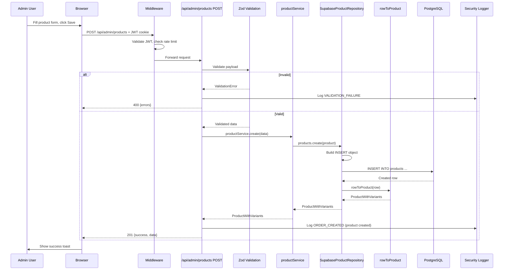
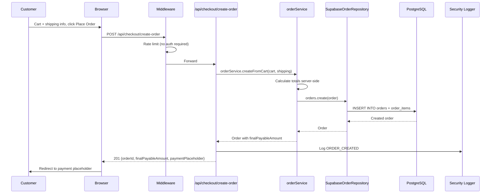
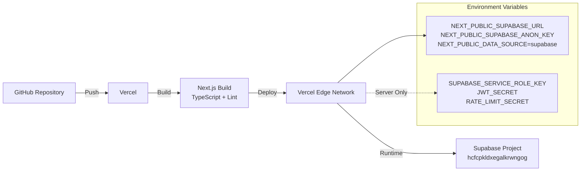

# Chouhan Mattress — Architecture Diagram

**Date:** August 1, 2026  
**Phase:** B — Production Backend  

---

## High-Level Architecture

```mermaid
graph TB
    subgraph "Client Layer"
        WEB[Web Browser]
        MOBILE[Mobile Browser]
    end

    subgraph "Edge / CDN"
        VERCEL[Vercel Edge Network]
        MIDDLEWARE[Next.js Middleware<br/>Auth + Rate Limit + Security Headers]
    end

    subgraph "Application Layer (Next.js 14 App Router)"
        SERVER_COMPONENTS[Server Components<br/>RSC - Data Fetching]
        CLIENT_COMPONENTS[Client Components<br/>Interactive UI]
        API_ROUTES[API Routes<br/>/api/admin/*]
        CHECKOUT_API[Checkout API<br/>/api/checkout/create-order]
    end

    subgraph "Business Logic Layer"
        SERVICES[Services<br/>Product, Order, Customer,<br/>Inventory, CMS, etc.]
        REPOSITORIES[Repository Interfaces<br/>IProduct, IOrder, ICustomer...]
        SUPABASE_REPOS[Supabase Repositories<br/>Implementations]
    end

    subgraph "Data Layer"
        SUPABASE_CLIENT[@supabase/supabase-js<br/>Server Client]
        POSTGRES[(Supabase PostgreSQL<br/>19 Tables + RLS)]
    end

    subgraph "Security"
        JWT[JWT Validation<br/>Middleware + API]
        RLS[Row Level Security<br/>PostgreSQL Policies]
        RATE_LIMIT[Rate Limiting<br/>Sliding Window]
        AUDIT_LOG[Security Audit Log<br/>Structured Events]
    end

    %% Connections
    WEB --> VERCEL
    MOBILE --> VERCEL
    VERCEL --> MIDDLEWARE
    MIDDLEWARE --> SERVER_COMPONENTS
    MIDDLEWARE --> CLIENT_COMPONENTS
    MIDDLEWARE --> API_ROUTES
    MIDDLEWARE --> CHECKOUT_API

    SERVER_COMPONENTS --> SERVICES
    CLIENT_COMPONENTS -.->|fetch| API_ROUTES
    CLIENT_COMPONENTS -.->|fetch| CHECKOUT_API

    API_ROUTES --> SERVICES
    CHECKOUT_API --> SERVICES

    SERVICES --> REPOSITORIES
    REPOSITORIES --> SUPABASE_REPOS
    SUPABASE_REPOS --> SUPABASE_CLIENT
    SUPABASE_CLIENT --> POSTGRES

    MIDDLEWARE --> JWT
    API_ROUTES --> JWT
    SERVICES --> RLS
    SUPABASE_REPOS --> RLS
    MIDDLEWARE --> RATE_LIMIT
    API_ROUTES --> RATE_LIMIT
    MIDDLEWARE --> AUDIT_LOG
    API_ROUTES --> AUDIT_LOG
```

---

## Repository Pattern Architecture

```mermaid
graph LR
    subgraph "Types"
        INTERFACES[IProductRepository<br/>IOrderRepository<br/>ICustomerRepository<br/>... 16 total]
    end

    subgraph "Factory"
        GETREPOS[getRepositories()<br/>Singleton Cache]
    end

    subgraph "Implementations"
        SUPABASE[SupabaseProductRepository<br/>SupabaseOrderRepository<br/>... 16 classes]
    end

    subgraph "Data Mappers"
        MAPPERS[rowToProduct<br/>rowToOrder<br/>rowToCategory<br/>... 13 mappers]
    end

    SERVICES[Services<br/>productService<br/>orderService<br/>customerService<br/>...] --> GETREPOS
    GETREPOS --> SUPABASE
    SUPABASE --> MAPPERS
    MAPPERS --> POSTGRES[(Supabase DB)]

    %% Interfaces implemented by
    INTERFACES -.->|implemented by| SUPABASE
```

---

## Data Flow: Admin Product Create



---

## Data Flow: Customer Checkout



---

## Security Boundaries

```mermaid
graph TB
    subgraph "Public (No Auth)"
        PRODUCTS_PUBLIC[/products, /product/[id]]
        CHECKOUT_API[/api/checkout/create-order]
        CART[CartContext - client only]
    end

    subgraph "Authenticated Customer"
        ACCOUNT[/account, /orders/[id]]
        CUSTOMER_RLS[RLS: customer sees own orders/addresses]
    end

    subgraph "Admin Only (Middleware + JWT)"
        ADMIN_PAGES[/admin/*]
        ADMIN_API[/api/admin/*]
        ADMIN_RLS[RLS: is_staff() = true]
        SERVICE_ROLE[Service Role Key - Server Only]
    end

    PRODUCTS_PUBLIC -->|anon key| SUPABASE
    CHECKOUT_API -->|anon key + rate limit| SUPABASE
    ACCOUNT -->|user JWT| SUPABASE
    ADMIN_PAGES -->|admin JWT| SUPABASE
    ADMIN_API -->|admin JWT + service role| SUPABASE
    SERVICE_ROLE -.->|NEVER in client bundle| SUPABASE
```

---

## Deployment Architecture



---

## Technology Stack Summary

| Layer | Technology | Version |
|-------|------------|---------|
| Framework | Next.js | 14.2.15 (App Router) |
| Language | TypeScript | 5.x (strict) |
| UI | React | 19 |
| Styling | Tailwind CSS | 3.4 |
| Animation | Framer Motion | 11 |
| Icons | Lucide React | Latest |
| Charts | Recharts | 2.x |
| Database | Supabase (PostgreSQL) | 15+ |
| ORM | Direct @supabase/supabase-js | 2.x |
| Auth | JWT + Middleware | Custom |
| Validation | Zod | 3.x |
| Rate Limit | Custom sliding window | In-memory |
| Logging | Structured JSON | Custom |
| Deployment | Vercel | Edge |

---

## File Structure (Relevant Paths)

```
src/
├── app/
│   ├── api/
│   │   ├── admin/products/route.ts      # Complete CRUD
│   │   └── checkout/create-order/       # Phase A
│   ├── admin/                           # Admin pages
│   │   ├── page.tsx                     # Dashboard (client)
│   │   ├── products/                    # Product CRUD UI
│   │   ├── orders/                      # Order management
│   │   └── ... 14 more modules
│   └── (storefront pages)
├── components/
│   ├── admin/                           # Admin UI components
│   └── library/                         # Storefront components
├── features/                            # Domain types
│   ├── products/
│   ├── orders/
│   ├── customers/
│   └── ... 16 domains
├── lib/
│   ├── auth/adminAuth.ts                # JWT validation
│   ├── rate-limit.ts                    # Sliding window
│   ├── security-logger.ts               # Audit logging
│   ├── validations/admin/               # Zod schemas
│   └── supabase/                        # Client creators
├── repositories/
│   ├── types.ts                         # 16 interfaces
│   ├── supabase/                        # 16 implementations
│   │   ├── *.ts (16 files)
│   │   ├── index.ts                     # Factory
│   │   └── mappers.ts                   # 13 mappers
│   └── mock/                            # DEPRECATED
├── services/                            # 13 services
│   ├── productService.ts
│   ├── orderService.ts
│   └── ... 11 more
└── types.ts                             # Shared types
```

---

## Key Architectural Decisions

| Decision | Rationale |
|----------|-----------|
| Repository Pattern | Swappable data sources, testable, separation of concerns |
| Factory `getRepositories()` | Singleton cache, lazy init, type-safe |
| Server Components for data fetching | Reduced client bundle, SEO-friendly |
| Client Components for interactivity | Icons, forms, charts need browser APIs |
| Zod validation at API boundary | Fail fast, type-safe input |
| RLS as primary authorization | Database-enforced, no bypass |
| Service role only in `server-only` | Never leaks to client |
| Payment-agnostic integration module | Plug any provider without business logic changes |