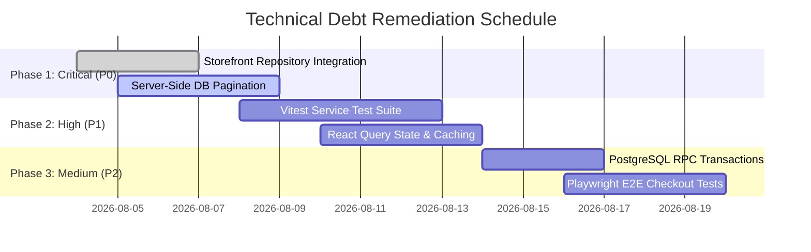

# Technical Debt & Architecture Refactoring Report

**Date:** 2026-08-03  
**Auditor:** Staff Backend & PostgreSQL/Supabase Architect  
**Target Project:** `c:\Users\Arti\wakefit-clone`  

---

## Executive Summary

This report provides a comprehensive evaluation of technical debt, architectural anti-patterns, missing test automation, state management limitations, and performance bottlenecks in the Chouhan Mattress codebase.

While the project features a well-structured **Repository-Service Pattern** and clean UI components, significant technical debt exists across multiple dimensions: complete absence of automated testing, client-side data pagination, lack of global caching/state management, raw JSONB column over-use, and hardcoded static data fallbacks in storefront components.

---

## 1. Categorized Technical Debt Inventory

```
+-------------------------------------------------------------------------+
|                       TECHNICAL DEBT CATEGORIES                         |
+------------------------------------+------------------------------------+
| 1. Automated Testing & Verification| 0% Coverage (No unit/E2E tests)    |
| 2. Data Fetching & Pagination      | Client-side array slicing (No DB)  |
| 3. State Management & Caching      | Raw useState/Context (No SWR/Query)|
| 4. Database & Relational Schema    | Embedded JSONB without FK constraints|
| 5. Security & Session Auth         | Dev mock bypass in middleware      |
| 6. Component Data Architecture     | Direct static JSON imports in PLP  |
+------------------------------------+------------------------------------+
```

---

### 1.1 Automated Testing Debt (Severity: HIGH)
- **Current State**: Zero unit tests, integration tests, or E2E test scripts exist in the repository. No test framework (`vitest`, `jest`, `playwright`, or `cypress`) is configured in `package.json`.
- **Impact**: Code refactoring or schema migrations risk introducing silent regressions in critical e-commerce flows (checkout, price calculation, discount verification).
- **Remediation**:
  1. Add `vitest` and `@testing-library/react` for unit testing services (`productService`, `discountService`, `orderService`).
  2. Add `playwright` E2E smoke tests for checkout flow (`/checkout`) and order creation API.

---

### 1.2 Data Pagination & Query Scalability Debt (Severity: HIGH)
- **Current State**:
  - `AdminDataTable.tsx` accepts an array of items in props and performs sorting, searching, and pagination client-side via JavaScript array methods (`slice((page-1)*pageSize, page*pageSize)`).
  - Repositories like `SupabaseOrderRepository.getAll()` and `SupabaseCustomerRepository.getAll()` query `SELECT * FROM orders` without `LIMIT` or `OFFSET`.
- **Impact**: While acceptable for small test datasets (<100 rows), this pattern causes severe network overhead, high browser memory usage, and execution timeouts when order/customer volume scales to 10,000+ records.
- **Remediation**:
  1. Upgrade `IOrderRepository`, `ICustomerRepository`, `IReviewRepository`, and `IAuditRepository` interfaces to support paginated queries: `search(filters: { page, pageSize, search, status }): Promise<{ items: T[]; total: number }>`.
  2. Update `AdminDataTable` to support server-side pagination callbacks (`onPageChange`, `onSortChange`, `totalCount`).

---

### 1.3 State Management, Caching & Optimistic UI Debt (Severity: MEDIUM)
- **Current State**:
  - The application relies solely on basic React Context (`AdminContext.tsx`, `CartContext.tsx`) and local component `useState`.
  - No server state caching library (`@tanstack/react-query` or `swr`) is integrated.
  - When an admin updates an order status or adjusts stock, the UI waits synchronously for the network round-trip without optimistic UI updates.
- **Impact**: Redundant API calls on route navigation, slower perceived user latency, and potential UI flickering.
- **Remediation**: Integrate `@tanstack/react-query` to provide automatic background revalidation, query key caching, and optimistic mutations for admin actions.

---

### 1.4 Architectural Layering & Storefront Static Imports (Severity: HIGH)
- **Current State**:
  - While the `/admin` module strictly follows the repository-service pattern via `productService`, `orderService`, etc., several storefront pages (`src/app/products/page.tsx`, `src/app/product/[id]/page.tsx`, `src/app/category/[slug]/page.tsx`) directly import `@/data/products.json` and `@/data/categories.json`.
- **Impact**: Disconnect between Admin Panel changes and Storefront UI. Adding or updating a product in the Admin Panel updates Supabase, but storefront pages displaying static JSON remain unchanged.
- **Remediation**: Refactor storefront pages to call `productService.getAll()`, `productService.getBySlug()`, and `catalogService.getAllCategories()` during Server-Side Rendering (SSR) or Server Components.

---

### 1.5 Security & Authentication Bypass Debt (Severity: MEDIUM)
- **Current State**:
  - `src/middleware.ts` and `src/lib/auth/adminAuth.ts` check `if (isDev && isMockMode)` to bypass authentication and grant fake `owner` permissions.
- **Impact**: Risk of accidental deployment with `NEXT_PUBLIC_DATA_SOURCE=mock` exposing administrative endpoints without authentication.
- **Remediation**: Ensure production build pipeline strictly validates `NEXT_PUBLIC_DATA_SOURCE === 'supabase'` and rejects builds if Supabase credentials or environment variables are missing.

---

## 2. Technical Debt Remediation Roadmap



---

### Action Items Summary

| Priority | Feature / Refactor | Target Components | Impact |
|----------|--------------------|-------------------|--------|
| **P0** | **Storefront SSR Service Cutover** | `app/products/page.tsx`, `app/product/[id]/page.tsx` | Connects storefront directly to Supabase DB via `productService`. |
| **P0** | **Server-Side Data Table Pagination** | `AdminDataTable.tsx`, `SupabaseOrderRepository` | Enables scalable fetching for 10,000+ orders/customers. |
| **P1** | **Automated Unit Testing** | `services/*.ts`, `repositories/supabase/*.ts` | Adds test suite enforcing business logic & calculations. |
| **P1** | **React Query Caching Layer** | `app/admin/**`, `features/**` | Eliminates redundant network calls & adds optimistic UI. |
| **P2** | **PostgreSQL RPC Order Creation** | `app/api/checkout/create-order/route.ts` | Guarantees atomic database transactions for order creation. |
